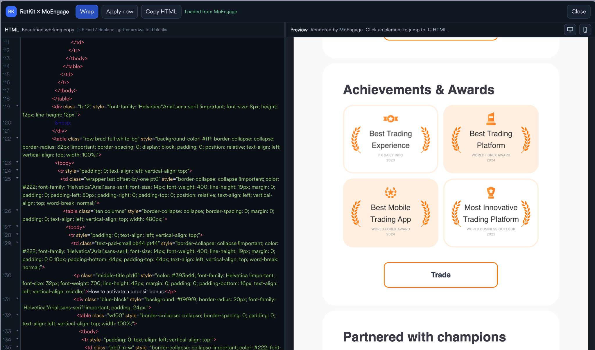
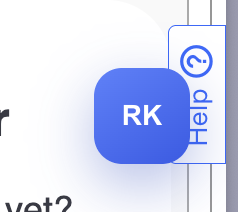
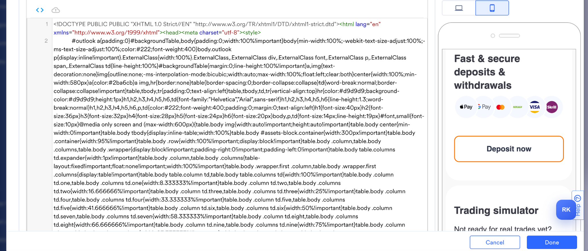

# RetKit × MoEngage

A browser-side productivity layer for editing HTML emails inside MoEngage.

RetKit keeps MoEngage as the source of truth, but replaces the cramped code-editing experience with a fullscreen HTML workspace, live rendered preview, click-to-source navigation, search/replace, folding, snapshots, and lightweight email-aware validation.

> Russian documentation: [README_RU.md](README_RU.md)



## Why

MoEngage can send the email, personalize it, and render its preview, but editing a large production HTML email in the native code view is uncomfortable. RetKit is designed for email developers who need to inspect and change large templates quickly without copying the campaign into another application.

RetKit runs only in your browser through Tampermonkey. It does not send email/customer data to an external service.

## v0.4.2 features

- Fullscreen HTML editor using MoEngage's own CodeMirror runtime.
- Beautified working copy with line numbers and optional line wrapping.
- Draggable code/preview split.
- Desktop and mobile preview icons inside the preview pane.
- Click an element in preview to jump to its current HTML source.
- Mixed-copy mapping: clicking normal text in `text <b>bold</b> text` selects the whole paragraph content including inline markup; clicking the bold copy selects only the bold text.
- Duplicate-aware mapping for repeated image URLs and links.
- `Cmd+F` / `Ctrl+F` Find + Replace.
- Replace current / Replace all.
- Fold structural HTML blocks from gutter arrows.
- Automatic apply back into MoEngage through the native CodeMirror + Froala Code View bridge.
- Manual `Apply now` retry.
- Up to 10 local snapshots per email with safe restore.
- Email-aware HTML validator with click-to-line issue navigation.
- Tampermonkey auto-update metadata.

## Install on Arc

Arc uses Chromium extensions, so Tampermonkey is installed from the Chrome Web Store.

1. Open Arc.
2. Open the Chrome Web Store.
3. Search for **Tampermonkey**.
4. Choose the official Tampermonkey extension and click **Add to Chrome** / **Add extension**.
5. Open Arc's extensions page and make sure Tampermonkey is enabled.
6. If Arc shows a setting named **Allow user scripts**, enable it for Tampermonkey.
7. Open Tampermonkey and choose **Create a new script** (`+`).
8. Replace the editor contents with `dist/retkit-moengage.user.js` from this repository.
9. Save with `Cmd+S`.
10. Reload MoEngage.

When this repository is public, you can also open the raw userscript directly and let Tampermonkey install it:

`https://raw.githubusercontent.com/Brokenbass90/retkit-moengage/main/dist/retkit-moengage.user.js`

## Install on Google Chrome

1. Open Chrome.
2. Open the Chrome Web Store.
3. Search for **Tampermonkey**.
4. Install the official extension.
5. Open `chrome://extensions` and confirm Tampermonkey is enabled.
6. Open **Details** for Tampermonkey and enable **Allow user scripts** if Chrome shows that option.
7. Open Tampermonkey → **Create a new script**.
8. Paste the contents of `dist/retkit-moengage.user.js`.
9. Save.
10. Reload MoEngage.

## Open RetKit in MoEngage

1. Open a MoEngage email campaign/template.
2. Switch the native template editor to HTML/Code View if necessary.
3. Wait until MoEngage's preview is visible.
4. A blue **RK** button appears in the lower-right corner.
5. Click **RK**.



If the RK button is not visible, see [Troubleshooting](#troubleshooting).

## Workspace

The left side is the beautified working HTML. The right side is a preview rendered from the current email HTML.

Drag the vertical divider to resize either side. Mapping is recalculated from the current preview DOM on every click, so resizing does not intentionally cache old source positions.

### Wrap

`Wrap` toggles long-line wrapping in the source editor. The preference is saved locally.

### Desktop / mobile preview

Use the monitor/phone icons in the **Preview** header. These change the local preview width; they do not change campaign targeting.

### Click preview → source

Click visible copy, a button/link, or an image in the right pane.

RetKit attempts to select the most useful source fragment:

- image → its `src` URL;
- visible text → the exact text node under the pointer;
- repeated images/links → the matching occurrence in the current DOM;
- fallback → id/class/text mapping where possible.

This is particularly useful for markup such as:

```html
<p>
  Go to <b>PROMO</b>, pick the offer → Click <b>Deposit</b>
</p>
```

Clicking `PROMO` selects only `PROMO`; clicking the ordinary copy selects that specific text fragment rather than the whole `<p>`.

## Find and Replace

On macOS:

- `Cmd+F` — open Find + Replace.
- `Cmd+Option+F` — also opens Find + Replace.

On Windows:

- `Ctrl+F` — open Find + Replace.
- `Ctrl+H` — open Find + Replace.

The bar supports previous/next match, Replace, and Replace All.

## Folding

Small arrows appear in the source gutter for multi-line structural blocks such as `table`, `tbody`, `tr`, `td`, and `div`.

Click an arrow to collapse/expand the block without changing the HTML.

## Applying changes to MoEngage

Editing RetKit updates the local preview immediately and then automatically pushes the HTML back into MoEngage.

The bridge uses the editor already loaded by MoEngage:

1. RetKit writes into MoEngage's native CodeMirror instance.
2. It triggers native editor input events.
3. It toggles Froala Code View so Froala accepts the HTML.
4. It checks that MoEngage did not revert the edit.

If automatic apply fails, use **Apply now**. The status text in the toolbar reports whether MoEngage accepted or reverted the edit.



## Snapshots and restore

RetKit keeps snapshots in the current browser profile only.

- **Save** — stores the current HTML manually.
- **History ▾** — opens up to the last 10 snapshots for this email.
- Click a snapshot to restore it.
- Before restore, RetKit automatically saves the current state as **Before restore**.

That means a mistaken restore can itself be undone from History.

Snapshots are stored in `localStorage`; they are not uploaded anywhere.

## HTML validator

The toolbar shows either:

- `✓ HTML`
- `⚠ N issues`

Click it to inspect issues and jump to the corresponding source line.

v0.4 checks for:

- unexpected closing tags;
- unclosed non-void tags;
- nested `<a>` tags;
- empty or `href="#"` links;
- `` without `src`;
- `` without `alt`.

Email-specific handling:

- void tags such as `img`, `br`, and `meta` are not expected to close;
- comments and Outlook conditional comments are ignored by stack matching;
- `style`, `script`, `pre`, and `textarea` bodies are treated as opaque.

The validator is intentionally lightweight. It is a production-safety helper, not a complete standards validator.

## Automatic updates

The userscript contains:

```text
@updateURL   https://raw.githubusercontent.com/Brokenbass90/retkit-moengage/main/dist/retkit-moengage.user.js
@downloadURL https://raw.githubusercontent.com/Brokenbass90/retkit-moengage/main/dist/retkit-moengage.user.js
```

After the public repository exists, Tampermonkey can check this URL and install newer versions. The exact update schedule depends on Tampermonkey settings.

The currently loaded version is visible next to **RetKit × MoEngage** in the toolbar.

## Troubleshooting

### RK button does not appear

Check:

1. You are on `dashboard-02.moengage.com`.
2. Tampermonkey is enabled.
3. The RetKit userscript is enabled.
4. Browser extension settings allow user scripts.
5. The MoEngage email editor has loaded its Code View/CodeMirror instance.
6. Reload the MoEngage page after updating the script.

### RetKit opens but says preview is not ready

Open/wait for the native MoEngage preview first, then click RK again.

### Changes show in RetKit but not in MoEngage

Use **Apply now** and read the status in the top bar. MoEngage can change internal editor behavior over time; the integration deliberately verifies whether the native editor kept the change.

### Click-to-source maps the wrong repeated block

v0.4 recalculates the descriptor on every click and tracks duplicate `src`/`href` occurrences. If a specific campaign still maps incorrectly, capture the clicked preview block and its corresponding HTML fragment when reporting the bug.

## Privacy and security

RetKit:

- runs locally in the browser;
- does not make its own network requests for email content;
- does not collect credentials;
- does not bypass MoEngage permissions;
- stores snapshots only in the browser profile.

It has access to the current MoEngage page because that is necessary to edit the template. Review the userscript before installing it in a production browser profile.

## Development

```bash
npm test
npm run check
```

`src/retkit-moengage.user.js` and `dist/retkit-moengage.user.js` must be identical for a release.

## Roadmap

See [ROADMAP.md](ROADMAP.md).

## License

MIT. See [LICENSE](LICENSE).
